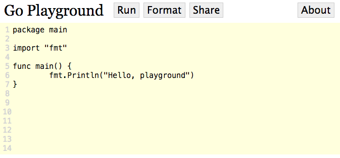
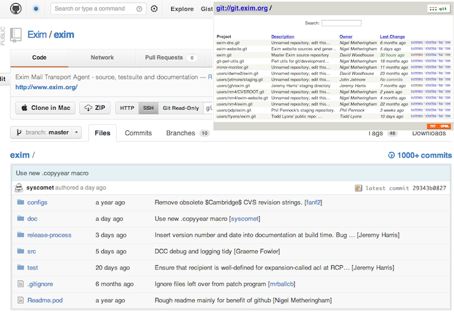
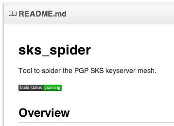
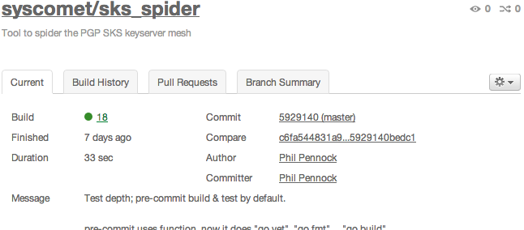

# Go Steel Programmers

## Beginners Guide to using Public Tools with Go

Phil Pennock, Apcera Inc.

<https://github.com/syscomet>

We'll get this up on <http://www.go-steel-programmers.org/> and the talk's git
repo on GitHub.

Nomenclature:

* Go Programming Language.
* Golang &mdash; used for disambiguation, in #tags, etc; eg:
  [Twitter #golang](https://twitter.com/search?q=%23golang)
* &ldquo;Go&rdquo; for short, in context.

_(This presentation made with [Landslide](https://github.com/adamzap/landslide).)_

---

# An Apology

Normally, I try to create slide-sets which augment a talk, where the talk is
recorded or somesuch and the speach is more important.

In this case, I opted for more of a prose style.  I can read out each slide
laboriously, or I can shove it up on screen for folks and talk around it,
answering questions.  I'm going to do the latter.

This way, the slides will be available as reference material later.

But this approach might fail miserably.  Please, don't let it fail miserably.

---

# Go Docs & Playground

Most Go presentations seem to reference various features provided by the Go
project itself.  We'll keep that to just this slide.

You should definitely know about the online documentation, a production running
instance of godoc.

1. Run `godoc -http=:6060` and point a web-browser at <http://localhost:6060/>
2. Or just go to <http://golang.org/>

The main other tool you should get in the habit of using is the Go Playground

* <http://play.golang.org/>
* Lets you type code in the browser, run it, share links to it.

---

# Okay, a second slide

<http://play.golang.org/>

---

# Directory Layout

## Boring

Much like `$PATH` or `$CLASSPATH`, building go code uses `$GOPATH`.  On
Unix-like systems, that's a colon-separated list of dirs.  On Windows,
semi-colons are used.  Unlike $PATH, Go uses a fixed layout within each entry.

Run `ls $(go env GOROOT)` to see the system code.  Pick a place to anchor your
main work.  I use `~/src/go`.  So code I write is in `~/src/go/src/...`.
Libraries installed with `go install` go into `~/src/go/pkg/$GOOS_$GOARCH/`,
commands into `~/src/go/bin/`.

If you're writing code that deals with checking stuff out automatically, please
do allow for multiple entries and take just the first element in the list.  In
    shell, that's `${GOPATH%%:*}`.

---

# Automatic Fetching

## Interesting

Much more interesting, `go get`, `go install`, etc can understand if an import
path has a hostname embedded in it and grok how to auto-fetch code, including
dependencies, recursively.  So if you can build entirely using Go project build
rules, everything needed to build can be fetched, if not already present, just
with `go install site.tld/top/level/cmd`.

The details are documented at: <http://golang.org/doc/code.html#remote>

This affects how you write the code:

    !go
    package main
    import "github.com/syscomet/namespace_test"
    func main() {
        namespace_test.Demonstration("Go Steel Programmers")
    }

Downside: hosting site is in the source code.  But the prefix parts of the path
are not part of the code namespace, even without using a renaming import.  Thus
`namespace_test.` and the only parts to change are the import lines.

---

# Git

That was a code fetch using a version control system.  Go supports several.  It
doesn't matter much which you use, but Git is currently the In Thing with wide
support and some nice features.

It doesn't matter too much which version control system you use, as long as Go
supports it.

Beware: Git also has horribly bad default command-line commands (the
"porcelain"), with an attitude of "just write porcelain which does what you
want", combining with traditional geek macho, to keep the default commands
complicated and confusing until you get used to them.

It's powerful, it's good, but don't try learning Git all at once and accept
that you'll learn it in bits and pieces.

---

# Git Tools

 * `git instaweb` &mdash; runs a web-server wrapper around `gitweb.cgi` and
    points a browser at it, for browsing the repo.

        !ini
        [browser "firefox"]
            path = /Applications/Firefox.app/Contents/MacOS/firefox
        [instaweb]
            local = true
            browser = firefox

* Storing password credentials in OSX keychain, or other native password
  management, is worthwhile to set up.

        !ini
        [credential]
            helper = osxkeychain

* Passphrase-based SSH with ssh-agent is your friend; set the public keys
  for the services you want to access.

---

# Distributed Version Control

Basic revision control lets you check in files, check them out, check in
changes, and look back to get the content at any previous point in time,
generating diffs as wanted.  Where you check them into might be a sub-directory
(SCCS, RCS), a central server, or "anywhere".

In place of a mandatory central server, DVCS have a model where folks don't
normally retrieve just the most recent version.  Instead, they keep a local
copy of the entire history so that most operations are local.

The content can then be reconciled between instances, on the same host or
remotely, over HTTP, SSH or other stuff, depending upon the DVCS.

Once you have this, you can _choose_ to make some location canonical, or
preferred, particularly if it provides useful additional tools.

---

# Exim

Exim uses Git, the canonical store is on [git.exim.org](http://git.exim.org/).
But we also use GitHub, <https://github.com/Exim/exim>.  Pushes to the
canonical store are automatically pushed to GitHub.

---

# GitHub

I'm using GitHub for this talk.  I don't work for them.  But they're decent and
there's a reason I'm using them as the example, and that my employer uses them
and an Open Source project I'm involved with increasingly uses them.

There are a few sites providing Git hosting with augmented tools.  Currently,
probably the most popular is GitHub.  Free unlimited hosting for public
repositories, my employer is a customer of the private repository support.

At a low level, the most important thing provided is a production-quality
staffed Git hosting facility, available over a couple of protocols, with decent
authentication infrastructure.

On top of that, are some decent sharing tools for choosing who gets commit
access, some adequate light code review and bug-tracking systems (optional),
wiki hosting, site hosting for simple static sites which are git checkouts.

And then the magic: hooks

---

# GitHub Hooks

Post commit details to IRC, trigger regression tests, update bug-tracking systems &hellip;

A webhook, fundamentally, is &ldquo;take some data representing an event, POST
it to a URL, and perhaps take action based on the response code&rdquo;.

Add authorisation tokens that can be embedded in a URL, and a standard encoding
format (typically JSON) and you're getting somewhere.

Add in a protocol translator site, taking site A's event and changing it to
something understood by site B and you have something powerful.  Provide a
library of those translations as part of the generating site and you can:

1. talk natively to a wide variety of sites with very simple template values
   supplied
2. generate the data to let folks plug code into _any_ other site.

https://github.com/$account/$project/admin/hooks
Eg: <https://github.com/syscomet/sks_spider/admin/hooks>

---

# Example project: sks\_spider

We'll see this used a bit, might as well explain it a little.

This is just some code I wrote, rewriting a Python WSGI app to be a Golang
HTTP server; in the process, it became faster and more responsive, using less
CPU and less RAM.  I'm using it as an example because it's on GitHub, has
tests, and is using Travis CI for Continuous Integration testing.

Project specific stuff that's boring if you don't like the topic:

* PGP keyservers store public keys and signatures for the Web-of-Trust
* The current main keyserver implementation is SKS, written in OCaml, which
  synchronises keys between keyservers using a reconciliation protocol.
* Each keyserver "peers" with one or more other keyserver, thus there is a
  peering mesh.
* Walking the mesh and checking the status of keyservers, counting the keys,
  etc, lets public pools of servers be published in DNS.
* This is a research/exploration project, not the code used for the main public
  pool
* Running at: <http://sks.spodhuis.org/sks-peers>

---

# Downside to `sks_spider`

I used a btree project which was written using the gotgo preprocessor to
support templates. It's powerful and pleasant, but not at all supported by the
normal build system.

Downside: normal build process doesn't work

Upside: I get to show a bit more about Travis configuration

---

# `go test`

The Go build system will skip files with names matching `*_test.go` when
creating a library or binary; instead, the `go test` command takes those files
and combines them into a test binary, supplying `func main()` itself.

Functions with signatures matching `func TestFoo(t *testing.T)` for some Foo
will be candidates for running in a test.

The `sks_spider` program currently has too few tests, but it has some: Go makes
it easy and I'm gradually building them up.

    % go test -v github.com/syscomet/sks_spider
    === RUN TestCountrySpodhuis
    --- PASS: TestCountrySpodhuis (0.01 seconds)
    === RUN TestCountrySets
    --- PASS: TestCountrySets (0.00 seconds)
    countries_test.go:80:   Countryset OK: NL,UK,US
    === RUN TestDepthSnapshot
    --- PASS: TestDepthSnapshot (0.02 seconds)
    depth_test.go:55:       Depth OK; 84 entries, max distance 3
    PASS
    ok      github.com/syscomet/sks_spider  0.048s

---

# Continuous Integration

Loosely: every time you push a change to the repository, it triggers a CI
system to fetch the code, build it, run the tests and report the results.  When
it generates a status badge, you can include that badge into even README.md
files to provide a convenient status report.  APIs will let you build more
comprehensive dashboards.

<https://travis-ci.org/syscomet/sks_spider>

---

# Travis CI

Two ways to configure the pairing GitHub &lrarr; Travis link:

1. Step through the process carefully, [it's documented](http://about.travis-ci.org/docs/user/how-to-setup-and-trigger-the-hook-manually/)
2. Grant Travis CI (via OAuth) permission to make the changes to your GitHub repo for you.

It basically boils down to generating a token on the Travis site, and
configuring a commit hook on GitHub.  Since it's a public repository, there's
no auth required to fetch the content.  Things are more involved for private
repositories.  Then, by default, pushes will trigger a test.  That simple?

---

# .travis.yml

Okay, you need to tell Travis _how_ to test your project.  Most simply:

    !yaml
    language: go

That's it.
Because Go has a built-in test framework, that's normally all that's needed.

The configuration is in YAML and the most relevant additional top-level keys
are `script` and `install`, each of which can be a list of multiple steps.

In Travis, the steps are combined into shell input, so you can set variables
in earlier steps and use them in later steps.

Travis works in `~/builds/` to start, but for Go will create `~/gopath/src/`
and `export GOPATH=~/gopath` so that `go get` paths all work.  The content is
pulled as a git checkout of the version that triggered a commit, linked into
place, and your current working directory is inside your project dir (under
`$GOPATH`), so that you can access `data/` files with relative paths.

---

# A better .travis.yml

    !yaml
    language: go

    script:
     - go vet
     - go test -v

The `go vet` command will catch things like .Printf() calls with mismatches in
%-expandos against the supplied arguments.  I've not seen a false positive yet,
thus so far I consider it a test failure if `go vet` complains.

---

# sks\_spider .travis.yml

This is the complexity you create for yourself by breaking out of pure Go build
compatibility.

    !yaml
    language: go

    install:
     - SPIDER_DIR="github.com/syscomet/sks_spider"
     - BTREE_DIR="github.com/runningwild/go-btree"
     - GOTGO_DIR="github.com/droundy/gotgo/gotgo"
     - CHECKOUT_TOP="${GOPATH%%:*}/src"
     - go get -fix -d -v "$BTREE_DIR"
     - "( cd \"$CHECKOUT_TOP/$BTREE_DIR\" && rm bench.go test.go )"
     - go get -d "$GOTGO_DIR"
     - go build -v "$GOTGO_DIR"
     - ./gotgo -o "$CHECKOUT_TOP/$BTREE_DIR/btree.go" "$CHECKOUT_TOP/$BTREE_DIR/btree.got" string
     - go get -d -v
     - go build -v sks_stats_daemon.go
     - go test -i

    script:
     - go vet
     - go test -v

---

# Too hot!  Too cold!

By default, Travis runs on every commit.  This is good when your first commits
to get Travis working are on a `travis_setup` branch.

Quickly, you get to where you want commits, say, only on the main branch and on
pull requests.  Configure it, and it shall be so.

Magic phrase in commit message: `[ci skip]`

    sks_spider$ git log

Recent addition: easy UI to force a retry when something failed because of a
transient glitch (eg, fetch from GitHub failed).

---

# Git pre-commit

You can't run your own code on GitHub to verify a push.
It's not your service and the security implications would be awkward.
If you run your own central repository, you **can** do this.

You can run pre-commit scripts to check before you even commit into your local
repository.  But beware that the pre-commit scripts are not natively part of
the repository, because you shouldn't be running arbitrary unseen code when you
run a local git command whenever you pull content.

So `$repo/.git/hooks/pre-commit` will need to be manually created when you set
up your checkout.

A good approach is to keep a collection of trusted pre-commit scripts in a repo.

A trusting approach is to create `git-hooks/` within your repo and create
`pre-commit` as a symlink pointing to `../../git-hooks/pre-commit` &mdash; instant
security hole, if anyone else can commit.  I've done this with sks\_spider for
demonstration purposes.

---

# Pre-commit steps

1. Use `foo=$(git config hooks.foo)` to grab any config items from
   `$repo/.git/config`
2. The content in the working directory at the time is not the content being
   committed; you need to ensure that what you test is what's part of the commit.
    * git stash --keep-index --all --quiet
    * git reset --hard --quiet; git stash pop --index --quiet
3. We run the first two of these by default, the second two only if asked:
    1. go vet
    2. go fmt -l -e $File
    3. go build
    4. go test

Further, additional build targets can be added, to exercise the `package main`
wrappers.

---

# Fin

Will be linked to from <http://www.go-steel-programmers.org/>

&copy; Apcera, Inc. 2012

<!-- vim: set sw=4 et wrap : -->
